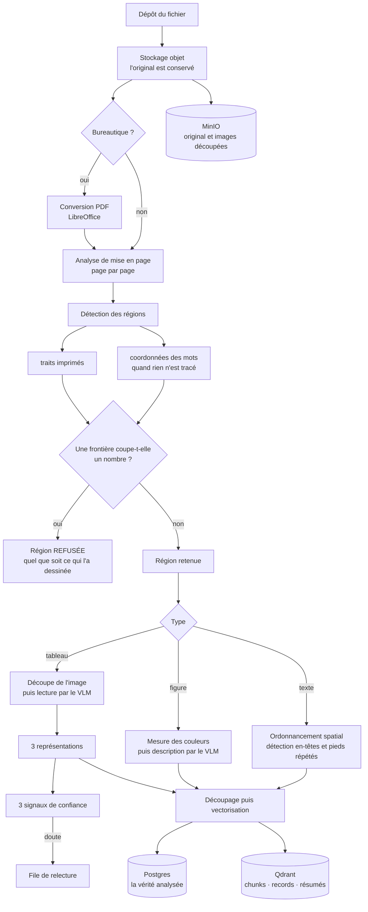

# Dossier source — rapport de stage LedgerRAG

**Stagiaire :** Ngô Anh Hưng
**Période :** 11/05/2026 → 28/08/2026 (16 semaines)
**Structure d'accueil :** CETIAT
**Projet :** LedgerRAG — plateforme RAG documentaire auto-hébergée, spécialisée
dans la lecture fidèle des tableaux PDF complexes.

---

## 0. Mode d'emploi de ce document

> **Ce fichier n'est pas le rapport.** C'est la base de faits à partir de
> laquelle le rapport final sera rédigé (en français, destinataire : CETIAT,
> registre « transfert technique »).

**Règles de rédaction à respecter pour le rapport final :**

1. **Aucun chiffre qui ne figure pas ici.** Tous les nombres de ce dossier sont
   soit issus de la commande indiquée, soit d'une mesure enregistrée dans
   `README.md`. Si un chiffre manque, le mesurer — ne pas l'estimer.
2. **Confidentialité :** CETIAT peut être nommé. Les documents clients ne le
   sont **pas** — on écrit « une convention collective », « des fiches
   produit financières », « des documents RH internes », jamais le nom du
   fichier ni celui d'un organisme tiers.
3. **Les limites connues (§9) font partie du livrable.** Un rapport de
   transfert qui les tait est un rapport faux : le lecteur va reprendre ce code.
4. Les champs `[À COMPLÉTER]` doivent être remplis par le stagiaire avant
   rédaction — ce sont des informations que le dépôt ne contient pas.

**Champs à compléter :**

| Champ | Valeur |
|---|---|
| Établissement / formation | `[À COMPLÉTER]` |
| Intitulé exact du stage | `[À COMPLÉTER]` |
| Tuteur entreprise (nom, fonction) | `[À COMPLÉTER]` |
| Tuteur école | `[À COMPLÉTER]` |
| Service d'accueil au CETIAT | `[À COMPLÉTER]` |
| Effectif de l'équipe / stage seul ? | `[À COMPLÉTER]` |
| Nombre d'utilisateurs finaux visés | `[À COMPLÉTER]` |
| Le rapport doit-il inclure des captures d'écran ? | `[À COMPLÉTER]` |

**Mise à jour de ce dossier** — voir §13. Les chiffres se régénèrent en une
commande ; à relancer avant chaque version du rapport.

---

## 1. Le problème

### 1.1 Le besoin métier

Le CETIAT dispose d'un fonds documentaire interne (documents RH, conventions,
fiches techniques et financières) au format PDF. Une partie décisive de
l'information utile n'est pas dans le texte courant mais **dans des tableaux** :
grilles de salaires, barèmes, tableaux croisés à plusieurs niveaux d'en-tête,
cellules fusionnées. Un agent qui cherche « quel est le barème pour tel
coefficient » doit aujourd'hui ouvrir le PDF et lire le tableau à la main.

### 1.2 Pourquoi ne pas prendre une solution existante

Les plateformes RAG open-source de la même classe (Dify, RAGFlow) traitent le
PDF comme du texte : un tableau y devient une suite de mots à plat, et
l'association ligne × colonne est perdue. Sur un texte courant la perte est
tolérable ; sur une grille de salaires elle est **silencieuse et fausse** — le
système répond un nombre, ce nombre existe bien dans le document, mais il
n'appartient pas à la ligne demandée.

C'est ce constat qui définit le positionnement du projet, écrit en tête du
`README.md` :

> **Parse it right, or fail honestly.**
> *Analyser correctement, ou échouer honnêtement.*

Chaque tableau conserve son image d'origine, chaque extraction porte un
indicateur de confiance, et le système dit « je ne suis pas sûr — voici le
tableau original » plutôt que d'inventer un nombre.

### 1.3 Contraintes non négociables

Reprises de `SPEC.md` §1 :

- **Auto-hébergement complet.** Aucune donnée ne sort du réseau du CETIAT.
  Aucun appel à une API cloud en production.
- **Multilingue, orienté français.** Le corpus est majoritairement francophone ;
  les nombres suivent la locale française (`7 462 639,50`, avec espace insécable
  étroite U+202F), ce qui met en défaut la plupart des analyseurs anglophones.
- **Matériel imposé :** le serveur interne `MIA-82025`, 3× AMD Radeon RX 9070 XT
  (RDNA4 / gfx1201, 16 Go chacune). Ce choix matériel est à l'origine d'une part
  importante des difficultés (§7.1).
- **Agnostique au modèle.** Changer de modèle doit être une modification de
  configuration, jamais de code.

---

## 2. Chronologie

Le dépôt Git couvre **du 03/07/2026 au 24/08/2026** : 299 commits. Les sept
premières semaines du stage (11/05 → 03/07) précèdent le dépôt et correspondent
à l'étude préalable, au recueil du besoin et à la mise en place de
l'infrastructure — ce travail n'a pas laissé de trace dans l'historique Git mais
conditionne tout le reste.

| Période | Phase | Contenu |
|---|---|---|
| 11/05 → ~31/05 | Étude préalable | État de l'art du RAG documentaire, évaluation des plateformes existantes (Dify, RAGFlow), identification du verrou « tableaux ». Rédaction de la spécification `SPEC.md`. |
| ~01/06 → ~20/06 | Recueil du besoin | Travail avec les utilisateurs finaux, collecte d'un corpus représentatif, définition de ce qu'est une « bonne réponse » — ce qui deviendra les jeux d'évaluation. |
| ~20/06 → 03/07 | Infrastructure | Mise en service du serveur `MIA-82025` : Docker, pilotes GPU, serveur d'inférence Ollama, réseau interne. C'est là qu'apparaît le premier piège matériel (§7.1). |
| 03/07 → 09/07 | **Phase 0** — dérisquage | Campagne de comparaison de modèles VLM sur le matériel réel. Jeu de test synthétique (12 tableaux, EN/FR/DE/ES). Sélection de `qwen3-vl:8b-instruct`. |
| 09/07 → 20/07 | **Phases 1–2** — squelette + tableaux | Chaîne complète ingestion → index → question/réponse. Sous-chaîne tableaux : trois représentations d'un même tableau. Première mesure de bout en bout : `eval-tables` = 88,4 %. |
| 20/07 → 21/07 | **Phases 3–4** — confiance & recherche | Signaux de confiance, file de relecture humaine. Recherche hybride dense + lexicale (fusion RRF), reranking, vérification arithmétique des nombres. **Passage du gate Phase 4** le 21/07. |
| 21/07 → 31/07 | **Phase 5** — multi-base & UX | Routeur LLM sur descriptions de bases, chat multi-base, interface web complète, journal d'audit RGPD, authentification par proxy inverse. Inspecteur de document avec édition manuelle. |
| 01/08 → 08/08 | Qualité de lecture | Figures et graphiques : mesure des couleurs puis description par le modèle. Pages en colonnes (diaporamas convertis) : ordonnancement spatial du texte, signalement automatique, relecture VLM à la demande. |
| 09/08 → 12/08 | Complétude des réponses | Site de documentation d'architecture auto-vérifié. Budget de contexte qui défend sa propre promesse. Correction du reranker (§7.5). |
| 13/08 → 17/08 | **Détection des tableaux** | Découverte que 88,4 % mesurait la mauvaise chose (§3.2). Nouveau détecteur fondé sur les coordonnées des mots : **25 % → 100 %**. |
| 17/08 → 18/08 | Internationalisation & diffusion | Interface en 5 langues. Citations cliquables dans le corps de la réponse. Intégration de l'assistant dans une application tierce par `<iframe>`. |
| 19/08 → 20/08 | Ouverture & mesure | API External Knowledge compatible Dify : une base devient le moteur de recherche d'une autre plateforme RAG. Contraste entre documents concordants/divergents. Le banc d'essai peut interroger un **assistant** et plus seulement une base — jusque-là aucun chiffre ne mesurait ce que les lecteurs utilisent vraiment. |
| 21/08 → 24/08 | Incident d'exploitation | Trois jours de panne et de diagnostic sur le serveur (§7.9). Rien de ce qui avait été mesuré n'était valide : le reclasseur était hors service depuis longtemps sans que rien ne le signale. |

**Volume produit** (au 24/08/2026) :

| | |
|---|---|
| Commits | 299 |
| Modules Python (`tablerag/`) | 80 fichiers, ~14 400 lignes |
| Code de test (`tests/`) | 98 fichiers, ~13 600 lignes |
| Tests unitaires | **1 118** |
| Frontend (Next.js) | 61 fichiers TS/TSX, ~11 100 lignes |
| Tests frontend (vitest) | 39, en 8 fichiers |
| Clés de traduction × 5 langues | 261 × 5 |
| Cibles d'évaluation (`make eval-*`) | 16, sur 8 jeux de questions |

> Le code de test Python représente **~88 % du volume du code Python applicatif**
> (12 400 lignes contre 14 000). Ce n'est pas un accident : c'est la conséquence
> directe de la philosophie du projet (§8).

---

## 3. Résultats mesurés

> **Tous ces chiffres proviennent d'exécutions sur le serveur de déploiement**,
> pas de la machine de développement. Chacun est daté.

### 3.1 Tableau de synthèse

| Gate | Ce qu'il mesure | Résultat | Date | Statut |
|---|---|---|---|---|
| `eval-tables` | Fidélité de **transcription** d'un tableau déjà découpé | **88,4 %** | 20/07 | Sous l'objectif de 95 % |
| `eval-detection` | Les tableaux d'une page réelle sont-ils **trouvés** ? | **100 % (12/12)** | 13/08 | Atteint (auparavant 25 %) |
| `eval-qa` — tableaux | Réponses correctes aux questions à réponse chiffrée | **19/20 (95 %)** | 21/07 | Atteint |
| `eval-qa` — texte | Réponses correctes aux questions en texte courant | **12/12 (100 %)** | 21/07 | Atteint |
| `eval-qa` — pièges | Questions sans réponse dans le corpus : le système refuse-t-il ? | **7/7 (100 %)** | 21/07 | Atteint |
| Signal de confiance | Taux de faux positifs (alerte à tort) | **0 %** | Phase 3 | Atteint |
| Signal de confiance | Rappel (détecter ses propres erreurs) | Faible | Phase 3 | **Non atteignable** — §9.2 |
| `eval-funds` | Sous-ensemble financier | **4/8** | — | Non attribué (§9.4) |

### 3.2 Le point le plus important du projet

**88,4 % et 25 % étaient vrais en même temps.**

`eval-tables` mesurait la transcription de tableaux **déjà découpés à la main
pour l'évaluation**. Il ne posait jamais la question : la plateforme
aurait-elle trouvé ce tableau sur la page ? Pendant plusieurs semaines, 88,4 % a
donc été lu comme « le produit fonctionne à 88 % ».

Le 13/08, un second gate a posé la vraie question sur des pages clients réelles.
Résultat : **25 % (3 pages sur 12)**. La détection renvoyait soit un bloc large
comme la page entière, soit rien du tout, dès qu'un tableau partageait la page
avec autre chose.

> *Lire un tableau qu'on avait trouvé marchait 88 % du temps. Le trouver sur une
> vraie page marchait 25 % du temps. Les deux nombres sont vrais et ils ne sont
> honnêtes qu'ensemble : un corpus peut être lisible à 88 % et rester
> inatteignable.*

**Leçon à mettre en avant dans le rapport :** une métrique qui mesure la mauvaise
chose est plus dangereuse que pas de métrique du tout, parce qu'elle achète de la
confiance sans rien garantir. Elle n'a été démasquée qu'en construisant
volontairement un second banc d'essai attaquant l'étape que le premier supposait
acquise.

### 3.3 De 25 % à 100 %

Le détecteur reconstruit (`tablerag/ingestion/word_tables.py`) n'utilise plus les
traits du PDF mais **les coordonnées des mots**. Quatre règles, chacune validée
par une mesure sur le serveur :

1. **Une colonne est une position x qui se répète** de ligne en ligne à
   l'intérieur d'une même série.
2. **Deux colonnes de page sont séparées par une bande** que peu de lignes
   traversent — la part de traversée est calculée dans une fenêtre autour de la
   coupe, et non sur la page entière.
3. **Deux tableaux empilés sont séparés par leur pas de ligne** : une rupture
   d'interligne supérieure à 1,5× le pas propre de la série termine celle-ci.
4. **Toute région dont une frontière tombe à l'intérieur d'un nombre est
   refusée**, quel que soit ce qui l'a dessinée — y compris un trait imprimé.
   `1 234,56` coupé en `1` et `234,56` est une erreur silencieuse qui produit un
   chiffre plausible et faux.

Progression mesurée à chaque étape : 25 % → 33 % → 42 % → 50 % → 83 % → 92 % →
**100 %**. Chaque palier correspond à une règle ajoutée après avoir observé la
page qui échouait, jamais après avoir supposé pourquoi.

---

## 4. Architecture livrée

### 4.1 Les quatre principes

`SPEC.md` §2 — leur violation est un motif de rejet, et le premier est vérifié
automatiquement par un test.

1. **La couche de stockage est le seul contrat.** `ingestion/` (écriture) et
   `query/` (lecture) ne s'importent jamais l'un l'autre — vérifié par
   `tests/unit/test_architecture.py`. Ils se rencontrent uniquement dans
   PostgreSQL, Qdrant et le stockage objet. *Conséquence pratique :* changer de
   modèle d'embedding ne demande qu'un ré-encodage, pas une ré-analyse des PDF.
2. **Un enregistrement sépare `dimensions` et `metrics`** (JSONB), et conserve
   toujours `raw_values` — la chaîne telle qu'elle était imprimée. On peut donc
   toujours revenir à ce que le document disait, indépendamment de
   l'interprétation qui en a été faite.
3. **Tout élément remonte à son origine :** `doc_id, page, bbox,
   crop_image_path, confidence`. La chaîne réponse → enregistrement → tableau →
   image découpée → page PDF est complète et cliquable dans l'interface.
4. **Routeur et Vérification sont des étapes enfichables.** Le pipeline de
   question est figé dès la Phase 1 :
   `Router → Retrieve → Rerank → AssembleContext → Generate → Verify`.

### 4.2 Structure

```
tablerag/
  api/         passerelle FastAPI (bases, documents, chat SSE, santé, embed)
  ingestion/   worker Celery : extraction → découpage → embedding → indexation
  query/       étapes du pipeline de question (asynchrone, streaming)
  storage/     ORM PostgreSQL + dépôts, client Qdrant, stockage objet
frontend/      Next.js 14 (App Router), React 18, 10 écrans
tests/
  unit/        1 052 tests, sans dépendance externe
  eval/        14 bancs d'essai exigeant le serveur réel
docs-site/     site d'architecture, auto-vérifié contre le code
```

Infrastructure : PostgreSQL (JSONB), Redis + Celery, Qdrant (vecteurs denses et
creux), MinIO (stockage objet), Ollama et vLLM (inférence), le tout en
composition Docker.

**Le chemin d'une question**, figé depuis la Phase 1 — chaque étape est
remplaçable sans toucher aux autres :

```mermaid
flowchart LR
    Q[Question] --> C[Condense<br/>replie un fragment<br/>en question autonome]
    C --> R[Router<br/>quelles bases,<br/>d'après leurs descriptions]
    R --> S[Retrieve<br/>dense + lexical<br/>fusion RRF]
    S --> K[Rerank<br/>50 candidats → 8]
    K --> A[AssembleContext<br/>résumé + lignes trouvées<br/>+ grille complète]
    A --> G[Generate<br/>réponse en flux<br/>avec citations]
    G --> V[Verify<br/>chaque chiffre est-il<br/>dans une source citée ?]
    V --> Rep[Réponse + sources<br/>+ avertissements]
```



Trois choses à retenir de ce schéma pour le rapport :

- **`Rerank` est facultatif et dégrade en silence.** C'est exactement ce qui
  s'est produit pendant des semaines (§7.9) : le pipeline continuait de
  répondre, avec 12 blocs au lieu de 8, sans que rien ne le signale.
- **`Verify` est mécanique, pas un jugement de modèle.** Il cherche les chiffres
  de la réponse dans les sources citées, en tenant compte de la locale.
- **`Router` dégrade vers « toutes les bases »** quand il échoue, plutôt que de
  ne rien chercher.

### 4.3 Choix techniques et leur justification

| Choix | Pourquoi |
|---|---|
| **Trois représentations d'un tableau** : enregistrements structurés, HTML d'affichage, résumé en langue naturelle | Chacune sert un usage différent — les enregistrements pour répondre exactement, le HTML pour montrer, le résumé pour être *trouvé* par une recherche sémantique. Un tableau n'est trouvable par aucune des deux autres. |
| **Recherche hybride dense + lexicale, fusion RRF** | Un barème se cherche autant par un mot exact (« coefficient 285 ») que par le sens. La fusion par rang réciproque évite d'avoir à calibrer deux scores d'échelles différentes. |
| **Contact d'escalade porté par l'assistant, pas par la base** | Une question qui traverse deux bases nommant deux services différents devait retomber sur une formule générique. **Nommer un service alors que la réponse vient du document de l'autre est pire que n'en nommer aucun.** Un assistant, lui, a un périmètre et une finalité uniques. |
| **`SeeAlso` distinct de `Citation`**, et volontairement non numéroté | Une figure ne peut pas être atteinte par le classement : ses nombres sont dans le dessin. On la propose donc *à regarder*. La lister parmi les sources dirait au lecteur que la réponse s'appuie dessus — on comblerait un trou dans ce qu'on montre en en ouvrant un dans ce que le lecteur croit. |
| **Configuration en JSONB plutôt qu'en colonnes** | Le projet utilise `create_all` sans migrations : cela ajoute des *tables*, jamais des *colonnes*. Toute option ajoutée après coup vit dans `config` — contrainte assumée et documentée, pas un oubli (voir §9.5). |
| **Interface par défaut en anglais**, libellés de langues écrits chacun dans sa propre langue | Quelqu'un qui cherche sa langue cherche « Deutsch », pas la traduction du mot « allemand » dans la langue courante. |
| **Deux verrous indépendants pour l'intégration `<iframe>`**, tous deux fermés par défaut | Un jeton par assistant (révocable), et un en-tête `frame-ancestors` qui vaut `'none'` tant que personne n'a déclaré qui a le droit d'encadrer la page. |

---

## 5. Idées structurantes

Ces sections décrivent des raisonnements — c'est la matière la plus utile pour la
partie « démarche » du rapport.

### 5.1 Échouer honnêtement plutôt que répondre à tout prix

Le réflexe d'un système RAG est de toujours produire une réponse. Sur des
nombres, c'est un défaut : une réponse plausible et fausse coûte plus cher que
« je ne sais pas ». Trois mécanismes concrets :

- Les questions **pièges** (7/7) font partie du jeu d'évaluation au même titre
  que les questions à réponse : refuser correctement est un résultat mesuré.
- Une réponse issue d'une extraction signalée douteuse **ne peut pas affirmer un
  nombre** — le système renvoie l'image du tableau.
- Quand la réponse n'est pas certaine, l'assistant oriente vers une personne
  compétente ; le service est configurable par assistant, et à défaut la
  formulation reste générique mais renvoie toujours vers un humain.

### 5.2 Un test qui ne peut pas échouer ne prouve rien

Discipline adoptée en cours de stage puis appliquée systématiquement : **avant de
déclarer un test réussi, on le casse volontairement pour le voir rougir, puis on
restaure.** Elle a démasqué trois gardes qui passaient à vide (§7.6) — dont la
plus importante du module d'intégration.

### 5.3 Mesurer avant de garder

Une idée développée puis **rejetée sur mesure** : l'expansion aux passages
voisins d'une source retrouvée. Elle améliorait la complétude apparente mais
faisait tomber les questions pièges de 7/7 à 1/7 et gonflait le nombre de
citations de 12 à 52. Elle a été retirée. Une alternative bornée (liste « voir
aussi ») a été retenue à la place.

> À mettre en avant : un stage produit aussi des choses qu'il faut savoir jeter,
> et la seule façon de le savoir est de les mesurer.

---

## 6. Ce que le produit sait faire

> Section à développer largement dans le rapport : c'est la description du
> livrable. Les trois sous-sections qui comptent sont 6.2 (l'analyse
> documentaire, le cœur du projet), 6.4 (les signaux de confiance) et 6.5 (la
> correction humaine, qui distingue ce produit d'un démonstrateur).

### 6.1 Les bases de connaissances

Une base est un corpus isolé. Rien n'est partagé entre deux bases : ni
documents, ni index, ni historique. Chacune porte :

| Réglage | Rôle |
|---|---|
| **Nom** | Ce que voit l'utilisateur. |
| **Description** | Ce que lit le **routeur** pour décider si une question concerne cette base. Ce n'est pas un commentaire : c'est un champ fonctionnel, et `make eval-routing` le mesure. Un bouton en rédige un brouillon à partir des documents présents. |
| **Format numérique** | `fr`, `en`… Déclaré plutôt que deviné — se tromper de séparateur de milliers produit une erreur d'un facteur 1000. |
| **Consignes** | Ton, format, priorités. S'ajoutent au noyau de sécurité, ne le remplacent jamais. |
| **Vérification des chiffres** | Active par défaut : chaque nombre d'une réponse est recherché dans les sources citées. |
| **Clé d'API externe** | Optionnelle, absente par défaut. Expose la base comme moteur de recherche pour une autre plateforme RAG (contrat Dify External Knowledge). |

### 6.2 La chaîne d'analyse documentaire

C'est le cœur du projet et ce qui le sépare des plateformes existantes. Formats
acceptés : PDF, Word, PowerPoint, Excel — les fichiers bureautiques sont
convertis en PDF une fois, pour suivre exactement le même chemin vérifié et
garder la même provenance page par page.



Deux points à souligner dans le rapport :

- **La détection ne fait pas confiance aux traits.** Un tableau peut n'avoir
  aucune bordure, et un trait peut ne pas être imprimé. Le détecteur travaille
  donc aussi sur les positions des mots (§3.3).
- **Une région dont une frontière tombe à l'intérieur d'un nombre est refusée**,
  même si c'est un trait du document qui l'a dessinée. `1 234,56` coupé en `1`
  et `234,56` produit un chiffre plausible et faux — le pire résultat possible
  pour ce produit.

L'ingestion est **idempotente par document** : relancer efface d'abord tout ce
que le passage précédent avait produit, il n'y a donc jamais de doublons.

### 6.3 Les trois représentations d'un tableau

Un même tableau est stocké trois fois, parce que trois usages ne peuvent pas
être servis par une seule forme :

| Représentation | Sert à | Sans elle |
|---|---|---|
| **Enregistrements** (`dimensions` / `metrics` / `raw_values`) | Répondre exactement : « ligne *classe 11*, colonne *SMH* » | Le modèle lit une grille à plat et se trompe de ligne |
| **HTML** | Montrer le tableau au lecteur, et le lui faire relire | Rien à afficher ni à vérifier |
| **Résumé en langue naturelle** | Être **trouvé** par une recherche sémantique | Le tableau existe mais reste inatteignable |

`raw_values` conserve la chaîne **telle qu'imprimée**. On peut donc toujours
revenir à ce que le document disait, indépendamment de l'interprétation.

### 6.4 Les trois signaux de confiance

Calculés à l'ingestion, ils décident si un tableau part en relecture :

1. **Cohérence structurelle** — le nombre d'enregistrements est-il compatible
   avec la forme du tableau lue en HTML ?
2. **Double lecture** — le tableau est lu deux fois ; les deux lectures
   s'accordent-elles (Jaccard sur les dimensions) ?
3. **Contrôle arithmétique** — quand une ligne « total » existe, la somme des
   composantes tombe-t-elle dessus ?

Faux positifs mesurés : **0 %**. Rappel : faible, et non atteignable sur ce
matériel (§9.2).

### 6.5 La correction humaine — 16 opérations

**C'est ce qui sépare ce produit d'un démonstrateur.** Un analyseur se trompe ;
la question est ce qu'un humain peut faire ensuite. L'inspecteur de document
expose, sur chaque élément analysé :

**Corriger le contenu**

| Opération | Ce qu'elle fait |
|---|---|
| Modifier | Corriger texte, HTML, enregistrements ou résumé. Ré-indexé immédiatement. |
| Annuler | Revenir à l'état d'avant la dernière modification. |
| Supprimer | Écarter un en-tête courant, un fragment parasite — ce qui ne fait que diluer la recherche. |
| Recalculer | Reconstruire enregistrements et résumé depuis le HTML corrigé à la main. Sans cela une correction du HTML resterait cosmétique. |

**Redemander au modèle**

| Opération | Ce qu'elle fait |
|---|---|
| Relire la page | Le VLM relit la **page entière** — utile quand la mise en page est en colonnes et que l'ordre du texte est douteux. Plusieurs modes de restitution. |
| Réanalyser plus fort | Le tableau est re-rendu depuis le PDF en double résolution et relu. **Proposition seulement : rien n'est écrit.** |
| Assistant d'édition | Demander une transformation en langue naturelle sur le contenu **non enregistré** ouvert dans l'éditeur. |

**Corriger la découpe** — c'est-à-dire corriger la détection elle-même

| Opération | Ce qu'elle fait |
|---|---|
| Séparer | « Ce sont deux tableaux » : la détection en a entouré deux. |
| Fusionner | « C'est un seul tableau » : la détection l'a coupé, typiquement entre deux pages. |
| Promouvoir en tableau | « Ce texte est un tableau », depuis du markdown ou du HTML. |
| Rétrograder en texte | « Ce n'est pas un tableau » : la détection s'est déclenchée sur de la prose mise en page. |
| Cellules fusionnées | Afficher une valeur répétée comme une cellule fusionnée, ou une par ligne. Affichage seulement. |

**Trancher la relecture**

| Opération | Ce qu'elle fait |
|---|---|
| Valider | Le relecteur confirme l'analyse ; l'alerte disparaît et les réponses citent ce tableau normalement. |
| Rejeter | L'analyse est fausse : les enregistrements **sortent de la recherche**, l'image d'origine reste comme repli honnête. |
| Voir l'image | L'image découpée, qui est l'autorité contre laquelle le relecteur juge. |

### 6.6 Interroger

- Chat **mono-base**, ou **multi-base** avec routeur automatique sur les
  descriptions (sélection manuelle possible).
- **Citations à l'intérieur des phrases**, cliquables, hiérarchisées selon la
  similarité (fortes en gras, faibles atténuées) ; liste complète en bas.
- **« Voir aussi »** : une figure présente sur une page utilisée, proposée à
  regarder — délibérément distinguée des sources (§4.3).
- **Questions de suite** : un fragment (« et pour 2024 ? ») est replié en
  question autonome avant recherche.
- **Assistants** : périmètre documentaire, consigne, message d'accueil, contact
  vers qui orienter en cas de doute.
- **Avertissements** : lecture d'image, confiance faible, à vérifier, chiffre
  non retrouvé dans les sources.

### 6.7 Ouverture et administration

- **Intégration `<iframe>`** d'un assistant dans une autre application, par
  jeton révocable, avec liste d'origines autorisées fermée par défaut.
- **API External Knowledge** compatible Dify : une base sert de moteur de
  recherche à une autre plateforme RAG.
- **Administration** : santé des modèles (avec *quelle couche a décidé* et la
  dernière erreur réelle), diagnostics, journal d'audit RGPD, authentification
  par proxy inverse.
- **Interface en 5 langues** (en, fr, vi, es, de).

---

## 7. Difficultés rencontrées

> Section centrale du rapport. Chaque difficulté est présentée avec **le symptôme
> observé**, **la cause réelle** et **ce qui a permis de la trouver** — c'est ce
> triplet qui a de la valeur pour le lecteur, pas la solution seule.

### 7.1 Le matériel : une panne qui ressemblait à de la lenteur

**Symptôme :** génération anormalement lente, et un blocage d'environ 30 secondes
au chargement du modèle.
**Cause :** Ollama est distribué avec ROCm 6.x, qui ne connaît pas l'architecture
RDNA4 (gfx1201) des cartes du serveur. Le GPU n'était pas utilisé : bascule
**silencieuse** sur le processeur.
**Pourquoi c'est difficile :** rien n'échoue. Il n'y a ni erreur, ni log, ni
alerte — seulement un système qui « marche, mais lentement ». Sans point de
comparaison, on attribue la lenteur au modèle.
**Traitement :** un script de pré-vol (`scripts/preflight.sh`) mesure le débit en
tokens/s et refuse de démarrer sous un seuil. La version d'Ollama est épinglée
dans la composition Docker, une mise à jour pouvant réintroduire le problème.

### 7.2 Un modèle qui répond correctement… en ne répondant rien

Le tag par défaut `qwen3-vl` est un modèle « à raisonnement » qui renvoie une
sortie **vide** via `/api/chat`. Le tag `-instruct` est obligatoire. L'échec ne
se présente pas comme une erreur, mais comme un document sans tableau.

### 7.3 La sensibilité du prompt d'analyse

Constat mesuré, inscrit en garde dans le `README.md` :

> **Ne jamais modifier le prompt de l'analyseur sans un A/B isolé sur
> `eval-tables` : un changement de formulation fait basculer des tableaux sans
> rapport entre 0 % et 100 %.**

Un ajustement destiné à corriger un tableau en cassait un autre, sans lien
apparent. La seule protection est le banc d'essai systématique.

### 7.4 La mauvaise métrique (voir §3.2)

La difficulté la plus coûteuse du stage, et la plus instructive : plusieurs
semaines de confiance dans un chiffre qui ne mesurait pas ce qu'on croyait.

### 7.5 Le reranker configuré, joignable, et jamais utilisé

Trois défauts empilés, découverts en cascade :

- une variable d'environnement définie sur l'hôte mais **jamais transmise au
  conteneur** — « un drapeau que le conteneur ne peut pas voir est un drapeau qui
  n'existe pas » ;
- une réponse **HTTP 413** (charge trop grande) avalée silencieusement : le
  reranker était appelé, échouait, et le système repartait sur l'ordre initial ;
- une ligne en base de données qui **écrasait en silence** un `.env` corrigé à la
  main — ce dernier point a coûté une journée de mesures ininterprétables.

**Traitement :** l'interface d'administration affiche désormais *quelle couche a
décidé* de chaque rôle de modèle (`database` / `environment` / `default`), ce que
dit l'environnement même quand il est masqué, et la dernière erreur réelle du
rôle — distincte d'une sonde de santé.

### 7.6 Trois gardes qui passaient à vide

Ce sont des tests **verts qui ne prouvaient rien**. Les trois ont été trouvés en
appliquant la règle du §5.2.

| Garde | Pourquoi elle passait à vide |
|---|---|
| « Toute route sous `/api/embed` exige un jeton » | Elle parcourait `app.routes` ; cette version de FastAPI conserve un routeur inclus comme **un seul objet opaque**. La garde trouvait une liste vide et passait. Corrigée en lisant le schéma OpenAPI. |
| « L'encadrement est fermé par défaut » | Elle cherchait la chaîne `'none'` **dans le texte du fichier** — chaîne qui apparaît aussi dans un commentaire. Passer le défaut à `*` la laissait verte. Corrigée en appelant réellement le middleware et en lisant l'en-tête produit. |
| « Un tableau à colonne d'étiquettes courte est déchiqueté » | Le test portait le nom du défaut mais ses trois colonnes restaient alignées : il n'exerçait pas le cas. Renforcé par une assertion sur le contenu exact d'une cellule. |

À quoi s'ajoutent deux tests dont les **données** étaient irréalistes : un
espacement de 76 points entre deux tableaux, qu'aucune page réelle ne présente ;
et un utilitaire de test attribuant la même largeur à tous les mots, ce qui
faisait réussir des reproductions de défauts censées échouer.

### 7.7 Le front : des pannes visibles seulement en conditions réelles

- **La langue revenait à l'anglais à chaque rechargement.** Le nom du cookie
  était exporté depuis un module `"use client"` ; un composant serveur qui
  importe une constante d'un tel module reçoit une *référence client*, pas la
  chaîne. `cookies().get()` ne correspondait donc à rien. Invisible en
  navigation, visible au seul rechargement. Corrigé en déplaçant la constante
  dans un module neutre, avec un test de garde.
- **Erreur `NotFoundError: The child can not be found in the parent`** au clic
  sur une source. Un traitement post-rendu réécrivait des nœuds de texte
  appartenant à React — sans effet tant que les paragraphes ne contenaient que du
  texte, fatal dès que des boutons de citation s'y sont intercalés.
- **Un générateur de jeton prévu côté navigateur** utilisait
  `crypto.randomUUID()`, disponible uniquement en contexte sécurisé — or le
  serveur est servi en `http` sur un nom interne. Le bouton n'aurait échoué
  **qu'en production**. Détecté à la relecture du plan ; le jeton est désormais
  produit côté serveur.

### 7.8 Difficultés de méthode

Deux erreurs de discipline, à assumer dans le rapport :

- **Avoir commité par-dessus une suite de tests rouge**, deux fois, en enchaînant
  test et commit dans une même commande — la commande de test échouait, le commit
  passait quand même. Pratique abandonnée ensuite.
- **Avoir annoncé une correction sans vérifier que le correctif s'appliquait**
  réellement au bon endroit.

---

### 7.9 Trois jours de panne, et ce qu'elle a révélé (21–24/08)

L'incident le plus instructif du stage, parce que la cause finale n'a rien à
voir avec le symptôme et que chaque étape du diagnostic a démenti la
précédente.

**Ce que voyait l'utilisateur :** « The assistant could not answer this question
due to an internal error. »

**La chaîne réelle, remontée à l'envers :**

| # | Fait | Comment il a été établi |
|---|---|---|
| 1 | Ollama mémorise les fichiers de modèles par `mmap`, laissant les tenseurs dans des pages adossées à un fichier | Log de chargement (`mmap = true`) |
| 2 | amdgpu ne peut pas épingler ces pages pour le GPU → **34 fautes de page par chargement** | A/B contrôlé : `mmap` activé = 34 fautes, désactivé = 0 |
| 3 | Une de ces fautes finit par être fatale → ~1 Go de vidage mémoire | 90 fichiers `core.*` dans le conteneur |
| 4 | 90 plantages = **85 Go** | `du` dans le conteneur |
| 5 | Plus 387 images Docker orphelines (**~95 Go**) : `--build` retire l'étiquette de l'ancienne image sans la supprimer | `docker system df` |
| 6 | **Disque plein à 100 %** (4,6 Mo libres sur 466 Go) | `df -h` |
| 7 | Disque plein → Ollama répond 500, et vLLM ne peut plus charger le reclasseur | Traces des deux services |

**Ce qui a rendu le diagnostic long — à raconter dans le rapport, c'est la
partie utile :**

- La trace d'exécution accusait Ollama ; le mot « disque » n'y figurait pas.
- `du ~/.ollama` sur l'hôte affichait **16 Ko** : les poids étaient dans un
  point de montage, l'hôte semblait innocent.
- `docker system df` annonçait 6 % d'images récupérables ; la purge en a libéré
  95 Go — l'outil sous-estime d'un facteur six à cause des couches partagées.
- **Quatre hypothèses successives se sont révélées fausses** : les journaux des
  conteneurs (535 Mo, pas 123 Go), la répartition sur deux GPU, la pression sur
  la VRAM, un pilote GPU bloqué. Chacune était plausible et chacune a coûté du
  temps.
- La machine était en outre **coincée dans une mise en veille inachevée**, ce
  qui empêchait systemd de créer de nouvelles unités : les conteneurs restaient
  « Starting » indéfiniment. Un serveur de modèles ne devrait jamais pouvoir se
  mettre en veille.

**La découverte la plus coûteuse est ailleurs.** En redémarrant le reclasseur,
sa propre trace disait :

```
VLLMNotFoundError: The model `BAAI/bge-reranker-v2-m3` does not exist.
POST /v1/rerank → 404
```

vLLM le sert sous l'identifiant `bge-reranker-v2-m3`, sans le préfixe. **Le
reclasseur était configuré, joignable, affiché « healthy », et n'avait jamais
reclassé quoi que ce soit** — la sonde de santé interroge `/v1/models`, qui
répond 200, alors que l'appel réel échouait. Corrigé, l'effet est immédiat :
`50 candidats → 8 retenus`, et les enregistrements de tableaux passent de
`rows=0` à `rows=4`.

**Conséquence méthodologique, la vraie leçon :** toutes les mesures antérieures
ont été prises sur une chaîne dégradée. Le nombre de blocs cités le disait
depuis le début — 12 (`retrieve_top_k`, sans reclassement) au lieu de 8
(`rerank_top_k`) — et personne ne l'avait lu. **Un banc d'essai doit refuser de
noter quand une étape du pipeline est en panne**, plutôt que produire un chiffre
qui a l'air normal.

**Ce qui a été corrigé pour que cela ne se reproduise pas :** `USE_MMAP=false`
côté configuration, `--ulimit core=0` sur le conteneur, `make deploy` qui purge
les images dans le bon ordre, rotation des journaux, et `docs/DEPLOY.md` §4 et
§6 qui consignent chaque piège — y compris les quatre fausses pistes, pour que
le prochain lecteur ne les reparcoure pas.

---

## 8. Méthode de travail et assurance qualité

### 8.1 Une spécification qui fait autorité

`SPEC.md` est la source de vérité unique : phases, définitions de « terminé »
(DoD), et une section « ce qu'on ne fera **pas** » explicitement destinée à
contenir la dérive de périmètre. Chaque phase a un critère chiffré à atteindre
avant de passer à la suivante.

### 8.2 Deux niveaux de vérification

- **`tests/unit/`** — 1 052 tests, aucune dépendance externe, exécutables sur un
  portable. Ils vérifient la logique, y compris les règles géométriques du
  détecteur de tableaux sur des coordonnées synthétiques.
- **`tests/eval/`** — 14 bancs d'essai qui exigent le serveur réel, ses modèles et
  de vrais documents. Ce sont eux qui produisent les chiffres du §3.

### 8.3 Des gardes contre la dérive de la documentation

Le site d'architecture n'est pas un document parallèle qui se périme : des tests
échouent lorsqu'un module n'a pas de place déclarée, lorsqu'un point d'entrée
d'API n'apparaît dans aucun flux, ou lorsqu'une référence à une ligne de code ne
pointe plus au bon endroit.

### 8.4 Les défauts connus sont enregistrés comme des tests

Les deux défauts ouverts du détecteur (§9.1) existent dans la suite sous forme de
tests `xfail` stricts : ils échouent aujourd'hui, et **la suite deviendra rouge le
jour où quelqu'un les corrigera sans mettre à jour leur statut**. Un défaut connu
ne dépend donc pas de la mémoire de celui qui l'a trouvé.

---

## 9. Limites connues et dette technique

> À reprendre intégralement dans le rapport. C'est ce que le lecteur doit savoir
> avant de reprendre le code.

### 9.1 Deux défauts ouverts du détecteur de tableaux — ⚠️ AVERTISSEMENT

**Ne pas relancer l'analyse des documents déjà en base.** Cet avertissement est
inscrit en toutes lettres dans le `README.md`.

Les 100 % de `eval-detection` sont mesurés sur six fiches produit. Deux défauts
trouvés lors de la relecture du 17/08 restent ouverts :

1. Un tableau dont **la première colonne est courte** et dont les écarts entre
   colonnes sont larges — de la forme `A | 1 | 21 700`, la forme la plus courante
   du corpus RH — est découpé en une bande par colonne. Il disparaît, ou pire : il
   est enregistré **sans sa colonne d'étiquettes**, comme des chiffres sans
   dimension.
2. La règle « une frontière ne coupe pas un nombre » s'applique désormais aussi
   aux régions tracées : une cellule contenant `0,90 1,40` — deux colonnes
   fusionnées par un filet non imprimé, cas déjà documenté comme fréquent dans
   les grilles RH — fait **tomber le tableau entier**, sans repli possible sur le
   détecteur par mots à cause du défaut (1).

**Rien de déployé n'est affecté tant que les documents ne sont pas ré-analysés :**
les modifications sont dans la chaîne d'ingestion et les éléments stockés sont les
anciens. Le danger est la prochaine ré-analyse ou le prochain dépôt de document.

### 9.2 Le rappel du signal de confiance n'est pas atteignable ici

L'objectif « ≥ 90 % des extractions fausses sont signalées » n'est pas atteint sur
ce matériel. Un petit modèle unique ne détecte pas ses propres erreurs commises
avec assurance ; des vérificateurs par modèle croisé ont été mesurés, tous moins
bons. Le taux de **faux positifs est en revanche de 0 %** : quand le système
alerte, il a raison.

**Le filet de sécurité réel est architectural, pas statistique :** l'image source
est toujours conservée, une réponse n'affirme jamais un nombre issu d'une
extraction signalée, et la relecture humaine est intégrée au produit.

### 9.3 L'objectif de 95 % en transcription n'est pas atteint

88,4 % avec `qwen3-vl:8b-instruct`. Les erreurs restantes sont des mauvaises
attributions de sous-lignes dans les tableaux croisés profonds : étiquettes
uniques mais fausses, sans signature structurelle exploitable. **Le levier est le
changement de modèle**, rendu peu coûteux par le principe d'agnosticité
(modification de configuration uniquement).

### 9.4 Un chiffre non attribué

`eval-funds` est resté à 4/8 sans que la cause soit établie : la mesure du nombre
d'éléments avant/après n'a pas été prise, on ne sait donc pas si les documents
concernés avaient été ré-analysés. **À signaler comme tel** — un chiffre dont on
ne sait pas ce qu'il mesure ne doit pas être présenté comme un résultat.

### 9.5 Absence de migrations de base de données

Le schéma est créé par `create_all`, qui ajoute des tables mais jamais de
colonnes. Toute option ajoutée après coup vit dans un champ JSONB `config`. C'est
tenable au stade actuel et documenté partout où c'est en jeu, mais **c'est la
première dette à rembourser** si le produit doit vivre (voir §10).

### 9.6 Validation de déploiement restant à faire

Définition de « terminé » de la Phase 5, non encore exécutée :

- 3 bases réelles × 10 questions de routage, ≥ 90 % ;
- une session d'utilisation **sans assistance** par un collègue du service RH ;
- un `docker compose up` complet sur une machine GPU vierge.

### 9.7 Cas non résolus

- Deux tableaux côte à côte sur une page sont lus comme un seul.
- Comparaison entre documents : le regroupement des passages est aveugle à la
  question posée, ce qui empêche certaines questions de mise en regard.

### 9.8 Authentification désactivée sur le serveur actuel

`auth.mode` vaut `disabled` : sur le réseau interne, tout le monde est
administrateur implicite. L'architecture par proxy inverse est en place et testée,
mais elle n'est pas activée. **Conséquence directe :** le jeton d'intégration
`<iframe>` n'est pas un secret dans cette configuration — il achète la
*révocabilité* et la possibilité d'activer l'authentification plus tard sans
casser les intégrations existantes, pas la confidentialité.

---

## 10. Perspectives — ce qu'il reste à faire

### 10.1 Court terme — avant toute remise en production

1. **Re-mesurer tous les gates**, maintenant que le reclasseur fonctionne
   (§7.9). Aucun chiffre du dépôt n'a été pris sur une chaîne complète : le
   `README` annonce `eval-qa` = 19/20 « avec reclasseur », ce qui est désormais
   douteux. C'est la première tâche, avant toute nouvelle fonctionnalité.
2. **Faire refuser le banc d'essai** quand une étape du pipeline est en panne,
   au lieu de produire un score. Le signal existait (12 blocs cités au lieu de
   8) et personne ne l'a lu pendant des semaines.
3. **Corriger les deux défauts du détecteur** (§9.1) et lever les `xfail`. Tant
   que ce n'est pas fait, l'interdiction de ré-analyser tient.
4. **Auditer la vérité de référence** avec `tests/eval/qa/CHECKLIST.md` : 176
   attentes écrites à la main, dont on sait maintenant qu'au moins quatre
   notaient une bonne réponse comme fausse.
5. **Exécuter la validation de déploiement** (§9.6), en particulier la session
   utilisateur sans assistance.

### 10.2 Moyen terme

6. **Surveiller le disque.** L'incident s'est constitué pendant des semaines
   sans que rien n'alerte ; une alarme à 85 % l'aurait pris très tôt.
7. **Introduire des migrations** (Alembic) pour sortir de la configuration en
   JSONB (§9.5).
8. **Comparaison entre documents** : rendre le regroupement des passages
   sensible à la question posée.
9. **Tableaux côte à côte** : deux tableaux partageant une bande horizontale
   sont lus comme un seul.
10. **Activer l'authentification** (§9.8).

### 10.3 Long terme

11. **Ingestion incrémentale** : ne ré-analyser que les pages modifiées.
12. **Boucle de retour** : exploiter les 👍/👎 déjà collectés pour prioriser la
    relecture humaine.
13. **Serveur MCP** pour exposer les bases aux outils qui parlent ce protocole,
    au-delà de l'`<iframe>` et de l'API External Knowledge.

---

## 11. Avec plus de GPU : quels modèles

> Question posée explicitement pour le rapport. Le principe d'agnosticité (C3)
> rend chacun de ces changements **une modification de configuration**, jamais
> de code — c'est précisément ce que cette contrainte achetait.

### 11.1 L'état actuel et sa contrainte

3× RX 9070 XT, **16 Go chacune**, en ROCm. Deux limites en découlent :

- **16 Go par carte** plafonne la taille des modèles. Répartir un modèle sur
  deux cartes fonctionne (mesuré) mais ajoute du trafic PCIe.
- **ROCm sur RDNA4** reste fragile : c'est la source des pannes du §7.1 et du
  §7.9.

Rôles actuels : parser `qwen3-vl:8b-instruct`, chat `qwen2.5:14b`, embedder
`bge-m3`, reclasseur `bge-reranker-v2-m3`.

### 11.2 Le levier le plus rentable : le parser (VLM)

**C'est ici que se joue le produit.** `eval-tables` plafonne à **88,4 %** contre
un objectif de 95 %, et les erreurs restantes sont des mauvaises attributions de
sous-lignes dans les tableaux croisés profonds — exactement ce qu'un modèle plus
grand lit mieux.

| VRAM disponible | Piste | Attendu |
|---|---|---|
| 24–32 Go | `qwen3-vl:32b` quantifié, ou un VLM document spécialisé | Le saut le plus probable vers 95 % |
| 48 Go+ | VLM 70B+ quantifié | Rendements décroissants pour ce type de document |
| inchangé | **Décodage contraint** (grammaire / schéma JSON imposé) | Gain sans matériel : supprime les sorties structurellement invalides |

**Protocole obligatoire :** tout changement de parser passe par un A/B isolé sur
`make eval-tables`. Le `README` porte cet avertissement parce qu'une simple
reformulation du prompt fait basculer des tableaux sans rapport entre 0 % et
100 %.

### 11.3 Le modèle de chat

`qwen2.5:14b` occupe ~15 Go avec son cache d'attention à 32k de contexte, soit
la totalité d'une carte. Avec plus de VRAM :

- **32B en 24–32 Go** — meilleur suivi d'instructions, ce qui viserait
  directement les échecs restants : les refus injustifiés (`a8`, `a10`, `a15`)
  et le piège `p6`, où le modèle calcule une moyenne à partir de minima malgré
  une règle explicite l'interdisant.
- **Un modèle européen** (famille Mistral/Ministral) — qualité en français, et
  argument de souveraineté pertinent au CETIAT.
- **Contexte plus long** sans compromis : aujourd'hui `TABLE_HTML_LIMIT` est
  calibré contre `chat_num_ctx=32768`, et un grand tableau consomme une part
  disproportionnée du budget.

### 11.4 Embedder et reclasseur

Les moins prioritaires : ils tiennent déjà largement en VRAM et le principe #1
rend leur remplacement peu coûteux (ré-encodage seul, **sans ré-analyse des
PDF**).

- Successeurs de `bge-m3`, ou approches à **interaction tardive** (ColBERT) —
  potentiellement décisives pour le point faible identifié : une question qui
  filtre par valeur (« les emplois de la classe 10 ») que les vecteurs denses
  ne savent pas servir (§3.2 et suivants).
- Un reclasseur plus grand ne servirait à rien tant que celui en place n'a pas
  été mesuré **une seule fois** en état de marche (§7.9).

### 11.5 Ce qu'il faut mesurer avant d'acheter quoi que ce soit

Une carte de plus ne résout rien si le goulot n'est pas là. Dans l'ordre :

1. Refaire tourner tous les gates avec la chaîne complète (§10.1) — la ligne de
   base actuelle n'est pas fiable.
2. Attribuer les échecs par étape : détection, transcription, recherche,
   génération. `make eval-detection` et `make eval-tables` séparent déjà les
   deux premières.
3. **Alors seulement** décider quel rôle mérite la VRAM supplémentaire.

Sur les données disponibles aujourd'hui, le parser est le candidat le plus
probable — c'est le seul gate qui échoue pour une raison purement liée au
modèle.

---

## 12. Technologies à surveiller

| Sujet | Pourquoi ça compte ici |
|---|---|
| **VLM de lecture de documents** (Qwen-VL, InternVL, modèles document dédiés) | Levier direct des 88,4 % → 95 %. À réévaluer sur `eval-tables` à chaque sortie. |
| **Décodage contraint / sortie structurée** | Supprimerait une classe entière d'erreurs sans matériel supplémentaire, et rendrait le prompt moins fragile (§7.3). |
| **Analyseurs de mise en page dédiés** (Docling, Marker, Table Transformer) | Alternatives ou compléments au détecteur maison. `eval-detection` existe désormais et fournit une base de comparaison honnête. |
| **ROCm 7 / maturité RDNA4** | Supprimerait la cause racine des §7.1 et §7.9. À suivre côté Ollama et llama.cpp. |
| **Backends Vulkan** | Voie de sortie de ROCm sur ce matériel, sans changer de cartes. |
| **Recherche à interaction tardive** (ColBERT et successeurs) | Vise le point faible démontré : les questions qui filtrent par valeur. |
| **MCP (Model Context Protocol)** | Voie normalisée pour exposer les bases aux outils tiers. |
| **Modèles de langue européens** (Mistral/Ministral) | Français et souveraineté, dans un contexte CETIAT. |

---

## 13. Mise à jour de ce dossier

Ce document doit être régénéré à chaque évolution significative du code.

```bash
# Chiffres de volume
git rev-list --count HEAD
git log --reverse --format=%ad --date=short | head -1
find tablerag -name '*.py' | wc -l
find tablerag -name '*.py' -exec cat {} + | wc -l
python -m pytest tests/unit --collect-only -q | tail -1
cd frontend && npx vitest run 2>&1 | grep -E 'Test Files|Tests '

# Résultats mesurés : toujours les relire depuis le README, jamais de mémoire
grep -oE '\*\*[^*]*[0-9]+([.,][0-9]+)? ?%[^*]*\*\*' README.md
```

> **Compter les tests frontend en lançant vitest, jamais en comptant les `it(`
> dans les fichiers.** Le comptage textuel a donné 49 là où la suite en exécute
> 39 — c'est exactement l'erreur que ce dossier reproche à `eval-tables` au §3.2,
> à une échelle inoffensive.

**Procédure :** relancer ces commandes, mettre à jour §2 (volume) et §3
(résultats), ajouter toute nouvelle difficulté au §7 avec son triplet
symptôme / cause / moyen de détection, et **retirer du §9 ce qui a été corrigé** —
une limite listée alors qu'elle est résolue décrédibilise toutes les autres.

**Avant de citer un chiffre de §3, vérifier que la chaîne était complète quand
il a été pris.** Le nombre de blocs cités le dit : 8 avec reclassement, 12 sans.
C'est ce contrôle qui manquait pendant des semaines (§7.9), et sans lui tout le
reste du dossier repose sur des mesures qui ont l'air normales.

Le §6 (fonctionnalités) et le §11 (matériel et modèles) ne se régénèrent pas :
ils se relisent quand une capacité est ajoutée ou quand le parc GPU change.

---

## Annexe A — Glossaire

| Terme | Définition |
|---|---|
| **RAG** | *Retrieval-Augmented Generation* — le modèle répond à partir de passages retrouvés dans les documents, et non de sa mémoire. |
| **VLM** | *Vision-Language Model* — modèle qui lit une image ; ici, l'image d'un tableau. |
| **Embedding** | Représentation numérique d'un texte permettant de mesurer une similarité de sens. |
| **Recherche dense / lexicale** | Par le sens / par les mots exacts. Les deux sont fusionnées (RRF). |
| **RRF** | *Reciprocal Rank Fusion* — combine deux classements sans avoir à calibrer leurs scores. |
| **Reranker** | Second modèle qui reclasse les passages retrouvés : plus précis, plus coûteux. |
| **Gate** | Seuil chiffré à franchir avant de passer à la phase suivante. |
| **DoD** | *Definition of Done* — critère explicite de fin d'une phase. |
| **`xfail` strict** | Test qui doit échouer ; s'il réussit, la suite devient rouge. Sert à enregistrer un défaut connu. |
| **Boilerplate** | En-têtes et pieds de page répétés, exclus de la recherche. |

## Annexe B — Chiffres clés (mémo)

```
Stage             11/05/2026 → 28/08/2026  (16 semaines)
Dépôt Git         03/07/2026 → 24/08/2026  (299 commits)
Code applicatif   ~14 400 lignes Python + ~11 100 lignes TS/TSX
Code de test      ~13 600 lignes, 1 118 tests unitaires + 39 frontend
Cibles eval       16, sur 8 jeux de questions (176 attentes)
Opérations de
correction        16, sur chaque élément analysé
Langues UI        5

--- mesures, à REFAIRE : toutes prises sans reclassement (§7.9) ---
Transcription     88,4 %          (objectif 95 % — non atteint)
Détection         100 % (12/12)   (25 % avant refonte)
Q/R tableaux      19/20 = 95 %
Q/R texte         12/12 = 100 %
Q/R pièges        7/7   = 100 %
Faux positifs     0 %
```

> **Avertissement à répercuter dans le rapport :** le bloc de mesures ci-dessus
> date d'avant la découverte du §7.9. Le reclasseur était hors service quand il
> a été produit. Les chiffres de détection et de transcription ne dépendent pas
> de lui et restent valides ; **ceux de question/réponse doivent être refaits**
> avant d'être cités comme résultat.
